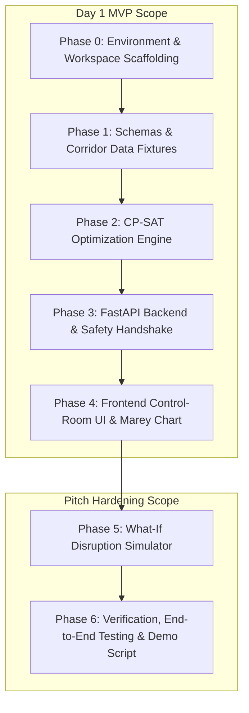

# RailSync-AI: Sequential Implementation Plan (PLAN.md)

This document provides the definitive step-by-step engineering roadmap for implementing the **RailSync-AI Automated Block Planning System (ABPS)**. It directly operationalizes the **Day 1 Sprint (24-Hour Runnable MVP)** and lays the architectural foundation for subsequent hackathon milestones.

---

## 1. Day 1 Sprint (24-Hour Runnable MVP) Mapping Matrix

Every file and component specified in the system architecture maps 1:1 to the implementation phases below:

| Architectural Component | Planned File Target | Implementation Phase | Key Deliverables & Responsibilities |
|---|---|---|---|
| `backend/requirements.txt` | `backend/pyproject.toml` | **Phase 0** | Python 3.11+ workspace managed via `uv`, OR-Tools, FastAPI, Pydantic v2. |
| `frontend/package.json` | `frontend/package.json` | **Phase 0** | React 18+ Vite TypeScript workspace managed via `pnpm`, Tailwind CSS, TanStack Query. |
| `backend/data_mock.py` | `backend/app/data_mock.py` | **Phase 1** | Ghaziabad–Aligarh (106 KM) corridor stations, base timetables, and multi-dept demands. |
| `frontend/src/types.ts` | `frontend/src/types.ts` & `backend/app/schemas.py` | **Phase 1** | Strict typed interfaces mirroring backend schemas (Station, Train, Demand, Block, Metrics). |
| `backend/optimizer.py` | `backend/app/optimizer.py` | **Phase 2** | Google OR-Tools CP-SAT discrete solver, interval variables, segment NoOverlap, bundling bonus. |
| `backend/main.py` | `backend/app/main.py` | **Phase 3** | FastAPI REST endpoints (`/corridor`, `/trains`, `/demands`, `/optimize`, `/grant-safety-token`). |
| `frontend/src/components/MareyChart.tsx` | `frontend/src/components/MareyChart.tsx` | **Phase 4** | Interactive SVG Time-Distance string chart with train paths and shaded possession boxes. |
| `frontend/src/components/KPICards.tsx` | `frontend/src/components/KPICards.tsx` | **Phase 4** | Capacity uptime gained, joint blocks created, closure hours saved, punctuality cards. |
| `frontend/src/App.tsx` | `frontend/src/App.tsx` | **Phase 4** | Control-room dashboard, optimizer trigger, demand queue, and BDMS safety handshake modal. |
| *SIH Demo Protocol (Disruption)* | `backend/app/main.py` & `frontend/src/components/DisruptionPanel.tsx` | **Phase 5** | What-if simulated delay injector and instant re-optimization. |
| *Verification & Pitch Walkthrough* | `backend/tests/` & Test Scripts | **Phase 6** | Pytest test suite, frontend build verification, demo rehearsal protocol. |

---

## 2. Optimization Model Formulation (Exact CP-SAT Engine)

### Mathematical Formulation
Let:
- $S = \{ (0, 30), (30, 60), (60, 106) \}$: Discretized spatial segments along the Ghaziabad (GZB) to Aligarh (ALJN) corridor (106 KM).
- $J$: Set of scheduled trains (Passenger Premium, Passenger Regular, Freight rakes).
- $M$: Set of ingested maintenance demands from TMS (Track), TDMS (OHE), and SMMS (Signalling).
- Horizon: $T = 720$ minutes (12-hour simulation window from 00:00 to 12:00, or extensible to 1440 min).

#### Decision Variables
- $s_m \in [0, T - d_m]$: Integer start minute for maintenance task $m \in M$.
- $e_m = s_m + d_m$: Integer completion minute for task $m \in M$.
- $I_m = \text{IntervalVar}(s_m, d_m, e_m)$: CP-SAT discrete interval variable for task $m$.
- $b_{m_1, m_2} \in \{0, 1\}$: Boolean indicator denoting synchronized execution of tasks $m_1, m_2$ (Integrated Block).

#### Objective Function
$$\max \quad \sum_{(m_1, m_2) \in \text{CrossDeptOverlap}} \gamma \cdot b_{m_1, m_2} - \sum_{m \in M} \alpha_m \cdot |s_m - t_{\text{target}}|$$
Where:
- $\gamma = 1000$: Heavy incentive reward for bundling cross-departmental works within 15 minutes of each other.
- $\alpha_m = \text{CriticalityScore}(m) \in [1, 100]$: Urgency weight derived from defect severity, overdue days, and track GMT.
- $t_{\text{target}} = 240$ (04:00 AM): Preferred low-density early morning maintenance window.

#### Constraints
1. **Disjunctive No-Overlap:** For every track segment $s \in S$, maintenance intervals and train occupancy intervals cannot intersect:
   $$\text{AddNoOverlap}(\{ I_{j,s} \mid j \in J \} \cup \{ I_{m,s} \mid m \in M_s \})$$
2. **Synchronization Tolerance:** $b_{m_1, m_2} = 1 \iff |s_{m_1} - s_{m_2}| \le 15 \text{ min}$ for spatial overlaps.

---

## 3. Sequential Implementation Phases

---

### Phase 0: Environment & Workspace Scaffolding (Day 1 MVP Baseline)
**Goal:** Initialize independent, reproducible backend (`uv`) and frontend (`pnpm`) workspaces matching developer standards.

- [x] **Step 0.1: Initialize Backend Workspace (`backend/`)**
  - Create `backend/` directory.
  - Initialize project with `uv init backend --app`.
  - Add core dependencies: `fastapi`, `uvicorn[standard]`, `pydantic>=2.6.0`, `ortools>=9.9`, `pandas>=2.2.0`, `scikit-learn>=1.4.0`, `pytest`, `httpx`.
- [x] **Step 0.2: Initialize Frontend Workspace (`frontend/`)**
  - Scaffold React 18+ TypeScript application via `pnpm create vite frontend --template react-ts`.
  - Install dependencies: `@tanstack/react-query`, `@tanstack/react-table`, `lucide-react`, `tailwindcss`, `postcss`, `autoprefixer`.
  - Configure Tailwind CSS (`tailwind.config.js`, `postcss.config.js`, `src/index.css`) with high-density control-room theme (slate-950/900 palette, cyan/emerald accents).
- [x] **Verification Gate:**
  - `cd backend && uv run pytest` runs clean.
  - `cd frontend && pnpm build` passes with zero TypeScript/CSS errors.

---

### Phase 1: Shared Domain Schemas & Synthetic Corridor Datasets
**Goal:** Establish single-source-of-truth data models and realistic Indian Railways operational fixtures.

- [x] **Step 1.1: Backend Pydantic Schemas (`backend/app/schemas.py`)**
  - Define `Station`: `id`, `name`, `km`.
  - Define `Train`: `id`, `name`, `type` (`PASSENGER_PREMIUM`, `PASSENGER_REGULAR`, `FREIGHT`), `start_km`, `end_km`, `dep_min`, `arr_min`, `priority`.
  - Define `MaintenanceDemand`: `id`, `department` (`ENGINEERING`, `TRACTION_TRD`, `SIGNAL_TELECOM`), `system` (`TMS`, `TDMS`, `SMMS`), `asset_type`, `activity`, `start_km`, `end_km`, `duration_minutes`, `urgency_days_overdue`, `track_gmt`, `severity` (`CRITICAL`, `URGENT`, `ROUTINE`), `power_block_required`, `signal_disconnection_required`.
  - Define `ScheduledBlock`: `demand_id`, `department`, `system`, `activity`, `start_km`, `end_km`, `scheduled_start_min`, `scheduled_end_min`, `duration_minutes`, `criticality_score`, `is_bundled`, `bundled_with`, `status`.
  - Define `OptimizationMetrics`: `uncoordinated_closure_hours`, `optimized_closure_hours`, `capacity_uptime_gained_percent`, `integrated_blocks_created`, `train_cancellations`.
  - Define `GrantBlockRequest` and `GrantBlockResponse`: `block_id`, `section_controller_id`, `tpc_private_number`, `depot_supervisor_id`, `system_private_number`, `ptw_id`, `ptw_timestamp`.
- [x] **Step 1.2: Synthetic Fixtures Generator (`backend/app/data_mock.py`)**
  - Corridor: Ghaziabad Jn (0.0 KM) to Aligarh Jn (106.0 KM) with 9 intermediate stations (Dadri, Boraki, Ajaibpur, Dankaur, Wair, Khurja Jn, Somna, Aligarh Jn).
  - Train Timetable: Lucknow Shatabdi (12004), Dibrugarh Rajdhani (12424), Unchahar Express (14218), Bihar Sampark Kranti (12566), Dadri Thermal Coal rake, Mathura POL Feeder freight rake.
  - Cross-Departmental Demands: TMS Plain Track Tamping (CSM), TDMS Cantilever & OHE wire overhaul, SMMS Point Machine Replacement at Dankaur, TMS USFD flaw removal at Khurja.
- [x] **Step 1.3: Frontend TypeScript Types (`frontend/src/types.ts`)**
  - Mirror all backend Pydantic schemas in strict TypeScript interfaces.
- [x] **Verification Gate:**
  - Automated Python schema roundtrip tests in `backend/tests/test_schemas.py`.

---

### Phase 2: Core Optimization Engine (Google OR-Tools CP-SAT)
**Goal:** Implement the multi-objective discrete solver that schedules conflicts and creates Integrated & Shadow blocks.

- [x] **Step 2.1: Defect Criticality Scoring (`backend/app/ml_scorer.py` / `optimizer.py`)**
  - Implement dynamic calculation and scoring rule ($1 \le DCS_m \le 100$):
    - Base severity score (`CRITICAL` = 70, `URGENT` = 50, `ROUTINE` = 30).
    - Overdue penalty $+ 2 \times \min(10, \text{days\_overdue})$.
    - High-density track GMT penalty $+ \min(10, \lfloor \text{GMT} / 10 \rfloor)$.
- [x] **Step 2.2: CP-SAT Optimization Engine (`backend/app/optimizer.py`)**
  - Model initialization: `cp_model.CpModel()`.
  - Interval variable creation for demands.
  - Spatial discretization into track segments ($0-30$, $30-60$, $60-106$ KM).
  - Interpolation of train occupancy windows per segment.
  - `AddNoOverlap` disjunctive safety constraints across trains and maintenance blocks.
  - Cross-department bundling incentive terms ($b_{m_1, m_2} \in \{0, 1\}$ within 15 min window).
  - Objective function maximization.
  - Post-processing: calculate corridor closure hours, capacity uptime gained, integrated block identification.
- [x] **Step 2.3: Unit Tests (`backend/tests/test_optimizer.py`)**
  - Test case: Solves within $<500$ ms.
  - Test case: No train trajectory overlaps with maintenance intervals on identical segments.
  - Test case: Correctly identifies and tags bundled joint blocks (e.g. TMS-001 + TDMS-002 at Dankaur).
- [x] **Verification Gate:**
  - `uv run pytest backend/tests/test_optimizer.py -v` passes with all assertions green.

---

### Phase 3: Backend REST API & Safety Handshake Protocol
**Goal:** Expose high-performance async endpoints and G&SR-compliant safety authorization tokens.

- [x] **Step 3.1: FastAPI Main Application (`backend/app/main.py`)**
  - Configure CORS middleware for local frontend development.
  - `GET /api/corridor`: Returns station metadata and corridor length.
  - `GET /api/trains`: Returns active timetable rakes.
  - `GET /api/demands`: Returns raw unbundled demands with dynamic criticality scores.
  - `POST /api/optimize`: Executes CP-SAT solver, stores scheduled state, returns scheduled blocks and efficiency metrics.
  - `POST /api/grant-safety-token`: Validates TPC private number, generates encrypted system Private Number (`PN-XXXXXX`), records Permit to Work (PTW) audit record.
  - `POST /api/disruption/simulate`: Injects train delay (e.g. $+45$ min on Rajdhani), triggers re-optimization, and returns schedule diff.
- [x] **Step 3.2: API Integration Tests (`backend/tests/test_api.py`)**
  - Test full HTTP lifecycle with `TestClient(app)`.
- [x] **Verification Gate:**
  - `uv run pytest backend/tests/test_api.py` passes.
  - `uv run uvicorn app.main:app --port 8000` responds accurately to curl requests.

---

### Phase 4: Frontend Control-Room UI & Interactive Visualizations
**Goal:** Construct an interactive, modern railway traffic controller interface.

- [x] **Step 4.1: KPI Metrics Panel (`frontend/src/components/KPICards.tsx`)**
  - Render cards: Corridor Capacity Gain %, Integrated Blocks Created, Total Closure Hours (Before vs After), Punctuality Retention %.
- [x] **Step 4.2: Interactive Marey Chart (`frontend/src/components/MareyChart.tsx`)**
  - High-performance SVG rendering of the 12-hour / 106 KM space-time grid.
  - Horizontal dashed lines for stations with chainage labels.
  - Vertical time grid lines at 60-minute intervals.
  - Train string lines: Emerald for Premium Passenger (Shatabdi/Rajdhani), Teal for Regular Passenger, Amber for Freight rakes.
  - Maintenance possession bounding boxes: Semi-transparent Orange (Individual), Red (Integrated Joint Block) with activity labels and hover tooltips.
- [x] **Step 4.3: Multi-Departmental Demand Queue & Table (`frontend/src/App.tsx` / `frontend/src/components/DemandTable.tsx`)**
  - Tabular view with department badges (Blue = TMS, Amber = TDMS, Emerald = SMMS).
  - Criticality score badges, location span, duration, and status indicators.
- [x] **Step 4.4: Safety Handshake Dialog (`frontend/src/App.tsx` / `frontend/src/components/HandshakeModal.tsx`)**
  - Modal dialog for granting Permit to Work (PTW).
  - TPC Private Number input, Section Controller identity confirmation, and cryptographic system token issue.
- [x] **Step 4.5: Root Layout Integration (`frontend/src/App.tsx`)**
  - Header with corridor status and "Run CP-SAT Optimizer" action.
  - TanStack Query hooks for asynchronous data polling and optimistic updates.
- [x] **Verification Gate:**
  - `pnpm build` succeeds.
  - UI renders without layout shifts or console errors.

---

### Phase 5: Dynamic Disruption Simulation & Re-Planning (Pitch Enhancer)
**Goal:** Enable real-time "what-if" disruption simulation demonstrating adaptive replanning.

- [x] **Step 5.1: Disruption Panel Component (`frontend/src/components/DisruptionPanel.tsx`)**
  - UI controls to select train (e.g. 12424 Rajdhani), inject delay (e.g. $+45$ min), or add an emergency track speed restriction (TSR).
- [x] **Step 5.2: Dynamic Re-Plan Solver Trigger**
  - Send disrupted state to `POST /api/disruption/simulate`.
  - Visual animation/transition on the Marey Chart showing train trajectory shifts and automatic maintenance window relocation.
- [x] **Verification Gate:**
  - Disruption injection immediately updates Marey Chart train lines and adjusts maintenance blocks without overlapping.

---

### Phase 6: End-to-End Verification, Demo Rehearsal & Git Tagging
**Goal:** Perform full integration verification and lock the repository for presentation.

- [x] **Step 6.1: End-to-End Test Suite**
  - Run full backend tests: `cd backend && uv run pytest -v`.
  - Run frontend type check and build: `cd frontend && pnpm build`.
- [x] **Step 6.2: SIH Pitch Protocol Rehearsal**
  - Verify 5-step demonstration flow (Siloed baseline $\to$ CP-SAT execution $\to$ Marey string chart inspection $\to$ Disruption injection $\to$ Safety handshake).
- [x] **Step 6.3: Atomic Commit & Clean Git History**
  - Ensure all milestones are committed following Mitchell Hashimoto guidelines.

---

## 4. Definition of Done (DoD)
1. Both backend (`uv`) and frontend (`pnpm`) build cleanly with zero errors or warnings.
2. CP-SAT optimizer generates zero train-maintenance collisions and bundles overlapping multi-department demands into Integrated Blocks.
3. Interactive Marey string chart visualizes all trains and maintenance intervals in real time.
4. Digital Safety Handshake generates verifiable Private Numbers under G&SR rules.
5. What-if disruption simulator successfully re-plans without manual schedule intervention.
